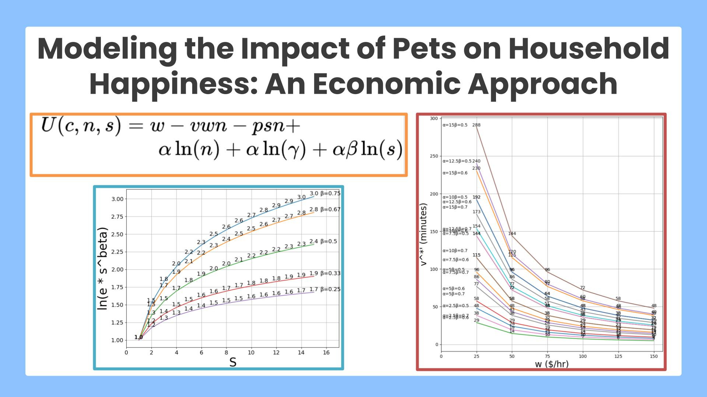

<!-->
## Modeling the Impact of Pets on Household Happiness: An Economic Approach
-->

  

This project develops an economic model that applies economic principles, such as utility optimization, budget constraints, opportunity cost and diminishing marginal utility, to explain how households make decisions about having pets. The model considers key parameters in this decision making, such as the household preference toward pet ownership, the number and wellbeing of pets, the cost of pets, the time spent to care pets, the household income, and the household happiness (life satisfaction). This work conducts a marginal cost-benefit analysis to examine the relationships among those parameters and derive the conditions to maximize the household happiness by having pets. Numerical experiment results reveal how parameter value combinations vary at the optima. 

This work was presented at a summer science fair of the Japanese Language School of Greater Boston ([poster](./poster-jls.jpg) in Japanese) and at [AnimalHack 2025](https://animalhack2025.devpost.com/) (presentation slides). 
