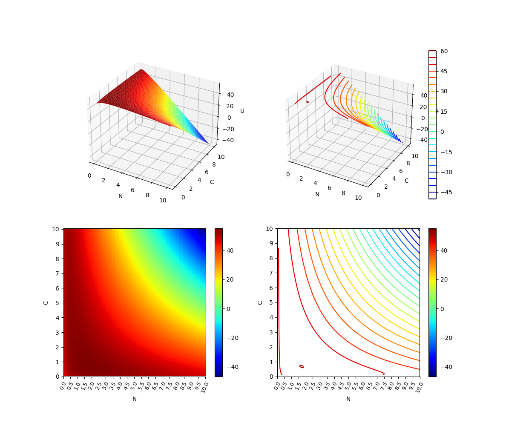

<!--
## Modeling the Impact of Pets on Household Happiness: An Economic Approach
-->

  

## Project Summary

This project studies a formal model that applies economic principles, such as utility optimization, budget and time constraints, opportunity cost, and diminishing marginal utility, to describe and explain how households make choices about having pets. Based on the microeconomic theories of the household, particularly for fertility, the proposed model considers key economic parameters in pet ownership choices such as the household preference to have pets, the number and welfare of pets, the price of pet care goods and services, the time spent for caregiving, the household income, and the household utility (household wellbeing). 

This work defines an optimization problem to maximize the household utility by having pets and conducts a marginal cost-benefit analysis to find the utility equilibrium. This work also carries out comparative statics analysis to examine the relationships among relevant parameters and derive hypotheses about pet ownership phenomena in the past and future.   

The proposed model serves as a ground for computational experiments with empirical data. Experimental results illustrate a utility landscape for average pet owners in the U.S. and reveal the combinations of parameter values at and around the utility equilibrium. The results also show how those parameters impact the household's choices about pet ownership and caregiving. 

This work is intended to aid the current and prospective pet owners to explore quantitative economic reasoning about pet ownership in the hope of reducing the chances of impulse pet acquisition, helping schedule pet care routines better, and reversing the on-going trend of pet relinquishment. 

## Informal Context to this Project

I wanted a pet, but my parents always disagreed, saying no one in our family has enough time to care for a pet. I went through stats, reports, and research papers about the time required for pet care, the benefits to having pets, pet relinquishment case studies at shelters, etc. Then I came across the economic theories for household fertility, which model the benefit and cost of children. I found them intriguing and thought they could be applied to model the benefit and cost of pets. This led me to studying those theories and expanding  my knowledge about microeconomics and calculus. I also tried to use my quantitative economic reasoning to convince my parents (which worked! I am looking for a cat now).

This work was presented at a summer science fair of the Japanese Language School of Greater Boston ([poster](./model1/poster-jls.jpg) in Japanese) and at [AnimalHack 2025](https://animalhack2025.devpost.com/) ([presentation slides](https://docs.google.com/presentation/d/1jVFw6v7WuYL-fCS8_CAo-duVvMBiGqPtpaCk-j4YjjI/edit?usp=sharing)). It won a [Grand Prix (1st Place) award](https://animalhack2025.devpost.com/project-gallery) at AnimalHack 2025. 

<!--

## Publications

-->

  

