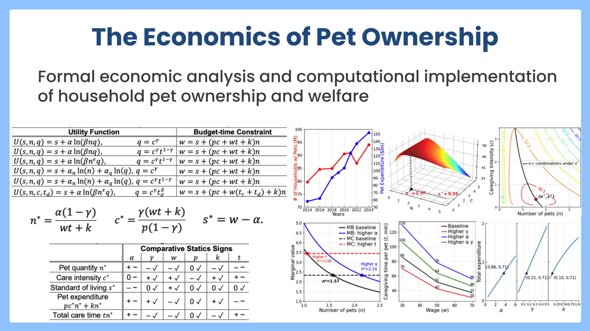
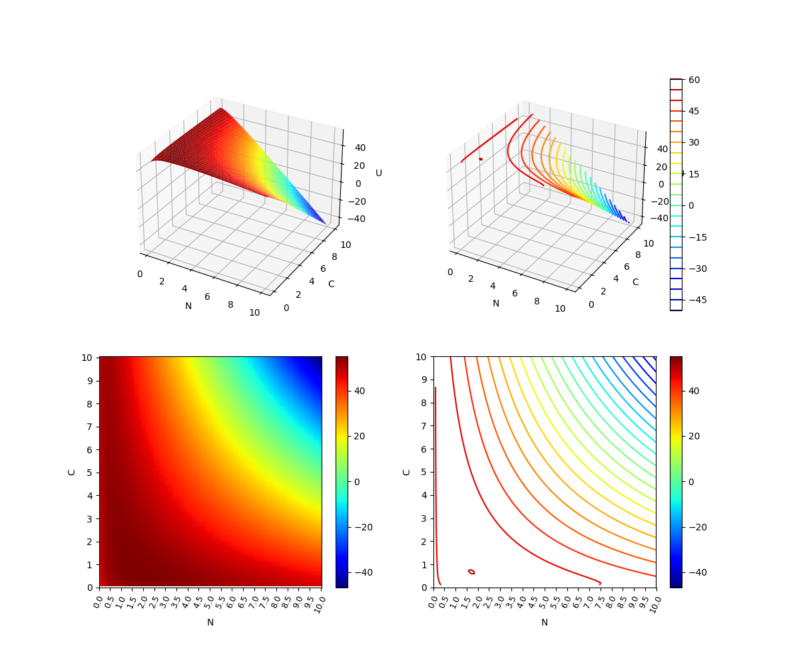

<!--
## Modeling the Impact of Pets on Household Happiness: An Economic Approach
-->

  

## Short Project Summary

This project studies a formal economic model that describes how households make choices about pet ownership. Based on microeconomic theories of fertility, the proposed model analyzes pet ownership as a rational, utility-maximizing choice. It considers key parameters in pet ownership choices and defines an economic problem to optimize these parameters with respect to household utility (welfare). The model yields marginal cost-benefit trade-offs to find the utility equilibrium. Comparative statics characterize the relationships among relevant parameters and derive hypotheses about pet ownership patterns over time. Computational experiments illustrate the household utility landscape and clarify how key parameters shape pet ownership choices. This work aids current/prospective pet owners to explore quantitative economic reasoning about pet ownership, with the goal of reducing impulsive acquisition, supporting better-organized care routines, and addressing the on-going trend of pet relinquishment.

<!--

This project studies a formal model that describes how households make choices about pet ownership. Based on microeconomic theories of fertility, the proposed model applies economic principles, such as utility optimization, budget and time constraints, opportunity cost, and diminishing marginal utility, to analyze pet ownership as a rational, utility-maximizing choice. The model considers key parameters in pet ownership such as preferences for pets, the number and welfare of pets, the price of pet-care goods, caregiving time and intensity, and household income.

, and defines an economic problem to optimize these parameters with respect to household utility (welfare).

 an optimization problem to maximize the household utility by having pets and conducts a marginal cost-benefit analysis to find the utility equilibrium. This work also carries out comparative statics analysis to examine the relationships among relevant parameters and derive hypotheses about pet ownership phenomena in the past and future.  

The proposed model serves as a ground for computational experiments with empirical data. Experimental results illustrate a utility landscape for average pet owners in the U.S. and reveal the combinations of parameter values at and around the utility equilibrium. The results also show how those parameters impact the household's choices about pet ownership and caregiving. 

This work is intended to aid the current and prospective pet owners to explore quantitative economic reasoning about pet ownership in the hope of reducing the chances of impulse pet acquisition, helping schedule pet care routines better, and reversing the on-going trend of pet relinquishment. 

-->

## Models

This project has been developing and analyzing multiple economic models.

- Model 1 (August to December 2025)
  - The initial baseline model. Deprecated now.
  - Model description
  - Presented at ASSET 2025, AnimalHack 2025, and 2025 Summer Science Fair of the Japanese Language School of Greater Boston.

- Model 2 (January 2026 -)
  - Revised baseline model. The utility function is inherited from Model 1. The budget constraint is revised to incorporate an additional pet-ownership expense. This is a fixed per-pet cost per period (or amortized per-period equivalent for one-time costs) that is independent from caregiving intensity. Examples include licensing, insurance premiums, adoption fee (amortized), breeder cost (amortized), spay/neuter, (amortized), initial vet exam and vaccinations (amortized), and microchipping (amortized).
  - [Model description](model2/model2.pdf)
  - Published and presented at ISEC 2026 ([short paper](./docs/isec26-poster-paper.pdf), poster)

- Model 3 (February 2026 -)
  - Revised from Model 2. The budget and time constraints are inherited from Model 2. The utility function is modified to have two separate companionship terms about pet quantity and pet quality (welfare). In Model 2, pet quantity and quality are combined into a single term.
  - Model description

- Model 4 (February 2026 -)
  - Revised from Model 2. The budget and time constraints are inherited from Model 2. The utility function is modified to adopt a Cobb-Douglas form that combines pet quantity and quality into a single companionship term.
  - Model description

- Model 5 (February 2026 -)
  - Revised from Model 2. The budget and time constraints are inherited from Model 2. The utility function is modified to consider caregiving time as an additional input in production of pet welfare.
  - Model description

<!--

  

This work was presented 

 ([presentation slides](https://docs.google.com/presentation/d/1jVFw6v7WuYL-fCS8_CAo-duVvMBiGqPtpaCk-j4YjjI/edit?usp=sharing)). 
-->

## Publications
  - Hanna Suzuki, "Analyzing the Impacts of Pets on Household Wellbeing," In *Proc. of the 16th IEEE Integrated STEM Education Conference (ISEC)*, poster presentation paper, Princeton, NJ, March 2026. [preprint](./docs/isec26-poster-paper.pdf) poster
  - Hanna Suzuki, "Modeling and Visualizing the Impacts of Pets on Household Wellbeing," In *Proc. of 5th American Society of Science, Engineering and Technology Conference (ASSET)*, oral presentation abstract, December 2025. [preprint](./docs/asset25.pdf)

## Presentations
  - Presented at a summer science fair of the Japanese Language School of Greater Boston ([poster](./model1/poster-jls.jpg) in Japanese). 
  - Presented at [AnimalHack 2025](https://animalhack2025.devpost.com/) and won a [Grand Prix (1st Place) award](https://animalhack2025.devpost.com/project-gallery).

## Informal Context to this Project

I wanted a pet, but my parents always disagreed, saying no one in our family has enough time to care for a pet. I went through stats, reports, and research papers about the time required for pet care, the benefits to having pets, pet relinquishment case studies at shelters, etc. Then I came across the economic theories for household fertility, which model the benefit and cost of children. I found them intriguing and thought they could be applied to model the benefit and cost of pets. This led me to studying those theories and expanding  my knowledge about microeconomics and calculus. I also tried to use my quantitative economic reasoning to convince my parents (which worked! I am looking for a cat now).

